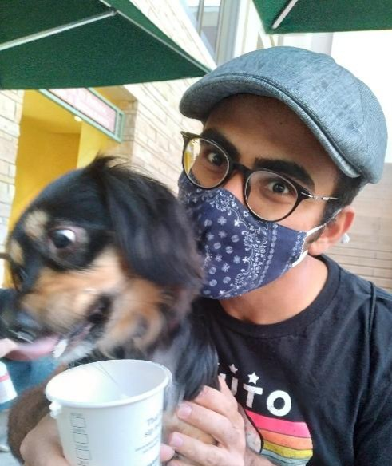

# Mahdi's Personal Page

Hi, My name is Mahdi Qezlou, a 4th year UCR-Carnegie graduate fellow. Currently, I'm working on the applications of Lyman Alpha Tompgraphy IMACS survey ([LATIS](https://iopscience.iop.org/article/10.3847/1538-4357/ab75ee/meta)). My work has mainly concerned with the detection and characterization of protclusters/groups in LATIS-like tomographies. Our work will be on arxiv very soon, stay tuned!!

I am always happy to learn about your work and chat about my work, so please email me : [mahdi.qezlou@email.ucr.edu](mahdi.qezlou@email.ucr.edu)

